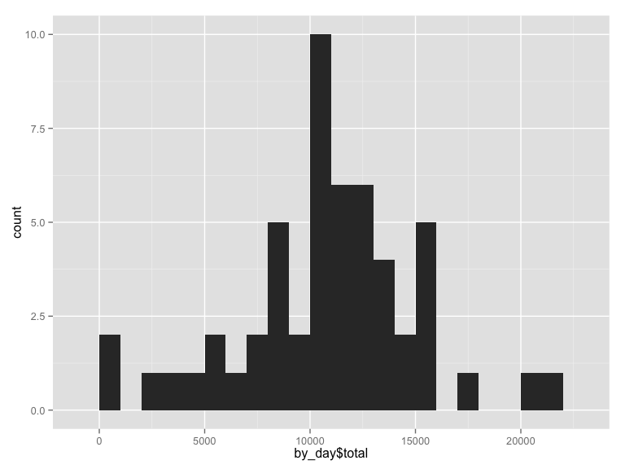
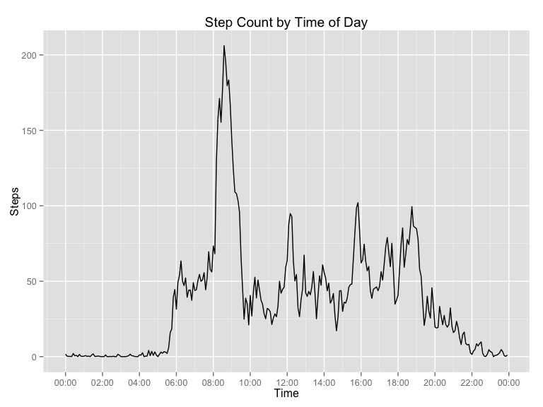
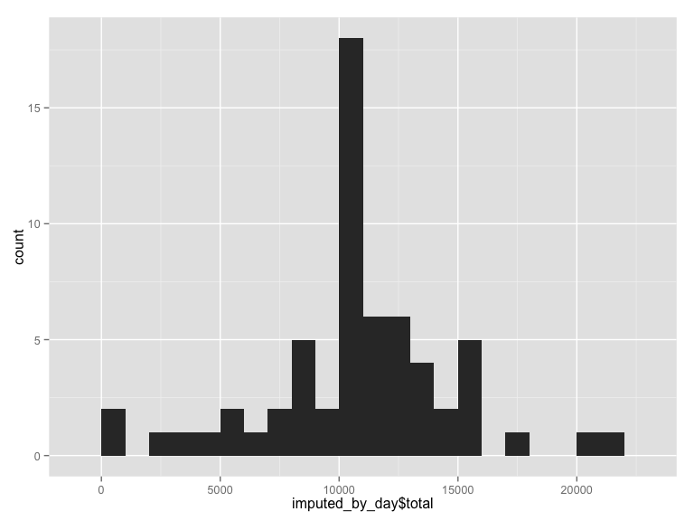
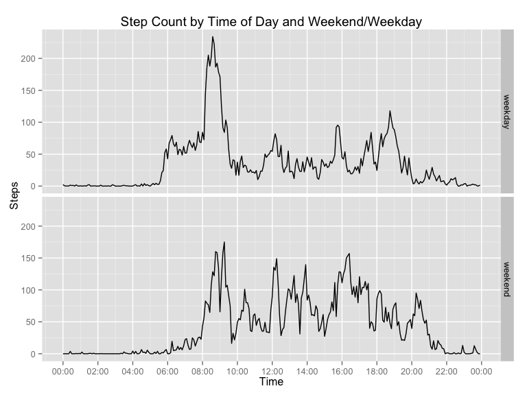

# Reproducible Research: Peer Assessment 1

## Assignment Overview

It is now possible to collect a large amount of data about personal movement using activity monitoring devices such as a Fitbit, Nike Fuelband, or Jawbone Up. These type of devices are part of the **quantified self** movement – a group of enthusiasts who take measurements about themselves regularly to improve their health, to find patterns in their behavior, or because they are tech geeks. But these data remain under-utilized both because the raw data are hard to obtain and there is a lack of statistical methods and software for processing and interpreting the data.

This assignment makes use of data from a personal activity monitoring device. This device collects data at 5 minute intervals through out the day. The data consists of two months of data from an anonymous individual collected during the months of October and November, 2012 and include the number of steps taken in 5 minute intervals each day.

I'll be using the following libraries to complete the assignment:


```r
library(dplyr)
library(ggplot2)
library(lubridate)
library(scales)
```
## Loading and preprocessing the data

Unzip the raw data into an activity.csv file, then load the data interpeting dates as strings.


```r
unzip('activity.zip', overwrite=T)
data <- tbl_df(read.csv('activity.csv', stringsAsFactors = T))
```
Now add a new column, `min` to represent the timestamp of the beginning of each 5 minute period.


```r
data$min <-  parse_date_time(sprintf('%04d', data$interval), '%H%M')
```

## What is mean total number of steps taken per day?

#### 1. First total up the steps taken each day.


```r
by_day <- group_by(data, date) %>% 
    summarize(total=sum(steps)) %>%
    filter(!is.na(total))
head(by_day)
```

```
## Source: local data frame [6 x 2]
## 
##         date total
## 1 2012-10-02   126
## 2 2012-10-03 11352
## 3 2012-10-04 12116
## 4 2012-10-05 13294
## 5 2012-10-06 15420
## 6 2012-10-07 11015
```

#### 2. Make a histogram of the total number of steps taken each day using a binwidth of 1000.


```r
qplot(by_day$total, binwidth=1000)
```

 

#### 3. Calculate the mean, median and total


```r
summary_values <- c(Median=median(by_day$total), Mean=mean(by_day$total), Total=sum(by_day$total))

cbind(Unfiltered=summary_values)
```

```
##        Unfiltered
## Median   10765.00
## Mean     10766.19
## Total   570608.00
```

## What is the average daily activity pattern?

#### 1. Plot the time series

First, group the data by interval.  Take the mean of the steps taken during that interval across all days.


```r
by_interval <- group_by(data, interval, min) %>% summarize(steps=mean(steps,na.rm=T))
```

Now plot the values in a time series.  Note that you have to use a timestamp (`min`) for 
the x-axis and not the numeric `interval` value or you'll end up with these small gaps
at the top of each hour because it plots 0-99 instead of 0-59.


```r
ggplot(by_interval) +
    aes(x=min, y=steps) + 
    geom_line() +
    scale_x_datetime(breaks=date_breaks("120 min"),
                     labels = date_format("%H:%M")) +
    labs(x='Time', y='Steps', title='Step Count by Time of Day' )
```

 

#### 2. Find the interval which has the highest average number of steps


```r
highest <- by_interval$min[by_interval$steps == max(by_interval$steps)]
strftime(highest, '%H:%M', tz='UTC')
```

```
## [1] "08:35"
```

## Imputing missing values

#### 1. What is the number of NAs in the steps field?

```r
sum(is.na(data$steps))
```

```
## [1] 2304
```

#### 2. Devise a strategy for filling in missing values

For each missing value for steps, I will use the mean value for that interval across all other days.

#### 3. Create a new dataset that is equal to the original dataset but with the missing data filled in


```r
imputed_data <- data
for (i in 1:nrow(data)) {
    if (is.na(data$steps[i])) {
        # Find the mean value for the given interval and assign it to the row with the missing value
        interval_mean <- by_interval$steps[which(by_interval$interval == data$interval[i])]
        imputed_data$steps[i] <- interval_mean
    }
}
```

#### 4. Make a new histogram an compare the mean and median steps between the origina and imputed data

First, group the imputed values by day and then plot the histogram.


```r
imputed_by_day <- group_by(imputed_data, date) %>% 
    summarize(total=sum(steps)) %>%
    filter(!is.na(total))
qplot(imputed_by_day$total, binwidth=1000)
```

 

Now calculate the median and mean values for the daily step count as well as the total number of


```r
imputed_summary_values <- c(Median=median(imputed_by_day$total), 
                            Mean=mean(imputed_by_day$total), 
                            Total=sum(imputed_by_day$total))
```

Use a matrix to compare with the original values with missing data.


```r
cbind(Original=summary_values, Imputed=imputed_summary_values)
```

```
##         Original   Imputed
## Median  10765.00  10766.19
## Mean    10766.19  10766.19
## Total  570608.00 656737.51
```

You can see imputing the values has a negligible impact on the mean.  Since the 
missing values are populated with a single value which is the mean, it stands to 
reason that the mean value would remain the same.  As you would expect
the total number of steps shifts significantly with the introduction of the imputed
measures.

## Are there differences in activity patterns between weekdays and weekends?

#### 1. Create a new factor variable in the dataset with two levels – “weekday” and “weekend”


```r
data$day <- as.factor(ifelse(weekdays(ymd(data$date)) %in% c('Saturday', 'Sunday'), 'weekend', 'weekday'))
```

#### 2. Make a panel plot comparing weekend to weekday activity

To generate the plot we need to create a new dataset grouped by interval as well as the weekend/weekday category.


```r
by_interval_and_day <- group_by(data, day, interval, min) %>% summarize(steps=mean(steps,na.rm=T))
```

Use a faceted plot to show the two panels.  You can see the activity begins later on weekend days.


```r
ggplot(by_interval_and_day) +
    aes(x=min, y=steps) + geom_line() +
    scale_x_datetime(breaks=date_breaks("120 min"),
                     labels = date_format("%H:%M")) +
    labs(x='Time', y='Steps', title='Step Count by Time of Day and Weekend/Weekday' ) +
    facet_grid(day ~ .)
```

 

